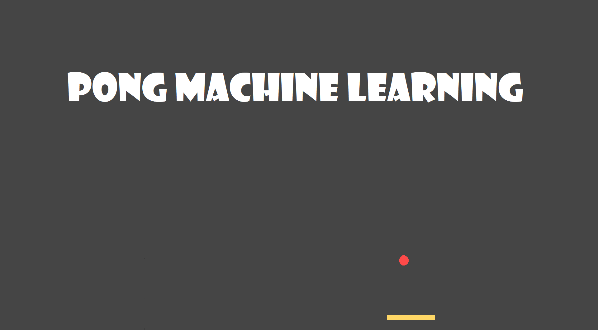
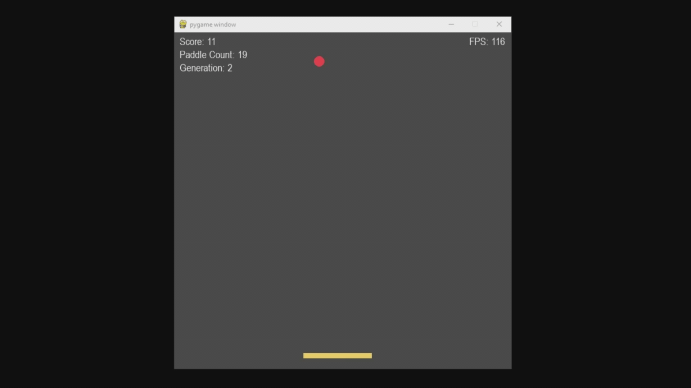
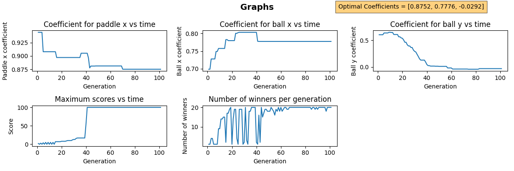

# pongML

## What is pongML?
PongML is a deep-learning program that teaches itself how to play Pong. It can create images of the graphs showing the trends of the program when the program finishes (i.e. when the user chooses to or when the program has reached its maximum number of generations)

You can look at this (very lossy) gif demonstrating the what happens in pongML:

## Example of the results pongML
The image below shows the graphs using a maximum score of 100 and maximum generation count of 100:

The results used to generate this graph can be found in `pongML_003_17-55-56.txt`

## Which .py file should I run?
There are several programs created that are all similar but not the same (and thus created in separate files):
- **`pongML.py`** -> The main program: shows a simulation of the program learning how to play pong
- **`pongML_no_visuals.py`** -> The program used to generate graphs quickly: does the same as `pongML.py` but there is no visible simulation
- **`pongML_with_coeff.py`** -> The program used to test coefficients: allows you to enter coefficients and lets the program play using those coefficients
- **`pong_simple_ai.py`** -> The program with a simple AI - unlike `pongML.py` it doesn't learn how to play, it just changes the paddle's x coordinates to match the ball's coordinates
- **`pong.py`** -> The pong game - the user can play pong in this program

## Other useful information
**WARNING** The program crashes if on the first round there were no successful paddles. This is a issue that I will resolve when I have free time

**NOTE** There are several sets of coefficients that allows the program to play successfully. If you get a set of coefficients different to the numbers above, that is very normal and totally fine - to prove this, you can enter the results on `pongML_with_coeff.py` and see the program play pong using your coefficients.