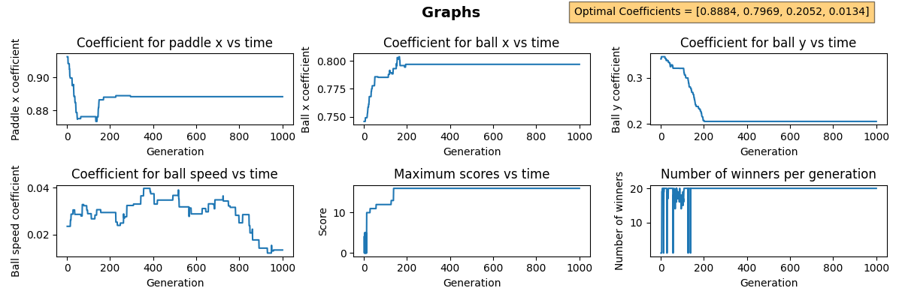

# pongML
A deep-learning program that teaches itself how to play Pong. Will create images of the graphs showing the trends of the program when the program finishes (i.e. when the user chooses to or when the program has reached its maximum number of generations)

The image below shows the graphs using a maximum score of 100 and maximum generation count of 1000:

Interestingly enough, the score doesn't seem to get any higher than 16, which seems like a bug, will need to investigate into that

**WARNING** The program crashes if on the first round there were no successful paddles. Need to be worked on